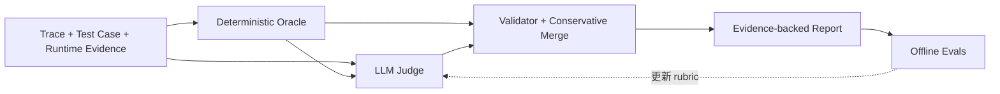

# Agent Trace 评估系统设计

> 当前基线：`trace-action-reaction-flow-v22`  
> 原则：证据优先；确定性事实优先；缺证据输出 `unknown`；未经校准的分数不是概率。

## 1. 要解决的问题

系统只回答三个问题：

1. **点对了吗**：Agent 是否找到并操作了正确目标；
2. **点击后反应对了吗**：是否出现测试用例要求的 UI、网络或状态变化；
3. **流程对了吗**：执行是否满足必需步骤、参数、顺序和最终结果。

工具调用成功、页面没有报错或轨迹与参考文本相似，都不能单独证明任务成功。

## 2. 最小架构



线上核心链路只有五步：输入事实、确定性判断、语义判断、本地验证与保守合并、结构化报告。
Offline Evals 不参与单次评分，只用于验证和升级评估器。

## 3. 输入

### 3.1 Trace

- `nodeId`；
- action 和参数；
- selector 或视觉定位信息；
- assertion 和 expected responses；
- 执行顺序。

### 3.2 Test Case

- 预期步骤、目标与参数；
- 预期 UI、网络或状态结果；
- 必要时声明可选步骤、允许的辅助动作和局部顺序约束。

```json
{
  "schema": "trace-eval.oracle-spec/v3",
  "nodes": {},
  "flow": {
    "optionalNodeIds": ["step_0001"],
    "allowedExtraActions": ["DoNothing"],
    "orderConstraints": [
      {"before": "step_0002", "after": "step_0003"}
    ]
  }
}
```

默认严格检查；只有测试用例显式声明时才允许替代路径。

v3 按稳定的 `nodeId` 对齐实际与参考节点，不做模糊语义匹配。跨录制会话若 ID 改变，调用方须
先明确归一化 trace、observations 和关联证据；未经对齐会报缺失/额外步骤，不推测它们等价。
未提供 `orderConstraints` 时保留参考顺序；提供空数组表示无顺序依赖。约束不得成环；涉及未执行
可选节点的直接边不检查。`allowedExtraActions` 是按动作类型授权，不是按目标或参数授权，应谨慎配置。

### 3.3 Runtime Evidence

- 实际目标、候选数量、点击点和目标框；
- actual action、完成状态和执行器证据；
- 网络响应；
- UI 或状态断言；
- 动作与反应的因果证据；
- 刷新或重新查询后的持久状态。

裸 `hit=true`、`completed=true` 或 `passed=true` 没有来源证明时只能判为 `unknown`。

## 4. Deterministic Oracle

Oracle 只判断可由运行证据确定的事实。

### 4.1 点对了吗

```text
目标已解析 → 候选唯一 → 语义身份正确 → 可操作 → 点击落入目标 → 动作完成
```

主要检查：目标解析、唯一性、语义身份、可见/可用/无遮挡、点击落点、边缘裕量和实际动作完成。

### 4.2 点击后反应对了吗

```text
动作前监听 → 动作执行 → UI/网络变化 → 因果归属 → 业务断言 → 持久状态
```

主要检查：网络响应、动作因果、直接断言、下一步状态、下游断言和刷新后持久状态。
观察到相同 URL 的后台请求不能证明它由本次点击导致。

### 4.3 流程对了吗

主要检查：

- 必需步骤是否完整；
- 是否有未允许的额外动作；
- 局部顺序约束是否满足；
- action、参数和目标是否一致；
- 最终业务结果是否有证据；
- 可选的重试和耗时预算是否满足。

可选步骤缺失不算失败；无依赖步骤可以换序，但必须由测试用例声明。
省略可选步骤输出 `not_applicable`，不计成功；`requiredStepSummary` 单独报告必需步骤证据覆盖率，
`optionalExecution` 报告声明/执行/省略数量。整体覆盖率仍受适用检查集合影响，不承诺跨路径可比。

所有实际步骤（含额外动作）的 Action、Reaction 和 Flow checks 都由 Oracle 生成，Judge 不再补造
流程事实。允许辅助动作不代表它执行成功，缺运行证据仍为 `unknown`，明确失败仍封顶相关分数；
额外动作自身声明的断言不能替代参考用例的最终业务结果。v3 的下一步检查验证实际路径的运行衔接，
路径是否合法另由 Flow 判断；下游断言还必须指向正确的后继节点。

### 4.4 四态输出

- `pass`：受控证据证明满足；
- `fail`：受控证据证明不满足；
- `unknown`：相关但证据不足；
- `not_applicable`：测试用例未要求。

## 5. LLM Judge

LLM 只处理确定性规则难以表达的语义问题：

- 动作是否合理推进任务；
- selector 和参数是否稳健；
- 动作是否符合前后文；
- assertion 是否真正覆盖业务结果；
- 路径是否存在不必要或脆弱行为。

每一步输出三个 claims：

```text
target_execution
post_action_reaction
testcase_conformance
```

并输出五个诊断维度：

```text
action_correctness
argument_quality
context_fit
evidence_quality
replay_safety
```

连续分数只用于排序和定位。业务是否成功优先看三个 claims 和最终 outcome。

## 6. 证据契约

每个 claim 和分数都必须引用本次输入中的具体证据。Evidence ID 绑定：

```text
scope + criterion/path + verdict/value digest
```

因此 pass 变 fail、selector 或观测值变化时，ID 也必须变化。哈希只证明引用了哪个输入，不证明输入
本身真实。`before`、`current.selector`、`flowOracle` 或“看起来正确”等泛化文字不能单独支撑评分。

## 7. Validator 与保守合并

LLM 输出必须通过本地检查：

1. 严格 JSON schema；
2. 节点集合与实际 trace 一致；
3. 每个维度都有 evidence 和 reason；
4. 每个 evidence token 都能回链；
5. claim 不得翻转确定性 oracle；
6. 编造节点、字段或证据时整次 Judge 失败。

合并规则：

- 确定性 `fail` 可以把相关维度封顶为 0；
- `unknown` 不等于 fail，不触发 0 分；
- 静态规则确认的缺陷不能被 LLM 高分覆盖；
- 总排序同时受规则、LLM、轨迹和证据覆盖率约束；
- 聚合值始终标记为 `ordering-only-not-a-probability`。

乘积只保证固定非负输入轴下的单调不增；零因子饱和与四位小数舍入会出现并列，不保证普遍严格下降。

## 8. 输出

报告最少包含：

- 每一步的三个 claims、五维分数和 evidence；
- 整体 trajectory 判断；
- 失败节点和确定性 findings；
- 聚合排序及其非概率标记；
- rubric、模型、prompt 和输入摘要 provenance。

报告必须保留分项，不能只返回一个总分。
`judge` 保留校验通过、未经保守合并的模型输出；顶层 `steps/trajectory` 是 Hybrid 结果。
Challenge 的 `modelOutputs/trajectory` 与证据审计只读取前者，`hybridTrajectory` 单独保存后者。
这是 Oracle 条件下的 Judge 契约测试，不是独立、盲测的模型准确率。

批处理逐行隔离无效 JSON、错误字段、引用文件错误及模型调用错误，记录输入位置并继续其余 case；
有错误时 CLI 返回非零。有效 case 的重复 ID、无法读取 manifest 或空 manifest 仍属于整批配置错误。

## 9. Offline Evals

上线前只保留四类门禁：

1. **Counterfactual**：注入误点、错误反应或流程缺陷后，相关 claim/排序必须变差；
2. **Evidence**：引用必须真实回链，反事实变化后 evidence 必须变化；
3. **Stability**：相同模型和 rubric 多次运行不得随机翻转；
4. **Human Gold**：真实准确率必须使用独立双人盲标数据。

合成 challenge 用来证明已知缺陷没有盲区，不代表真实准确率。真实评估至少报告三个 claim 各自的
confusion matrix、coverage、abstention、selective accuracy、effective accuracy 和 Wilson 95% 区间。
只有显式且经过校准的 probability 才计算 Brier/ECE。

## 10. 核心模块

| 模块 | 职责 |
|---|---|
| `trust/observations.py` | 提取运行证据 |
| `trust/oracle.py` | Target、Action、Reaction、Flow oracle |
| `trust/oracle_spec.py` | 测试用例扩展约束 |
| `trust/judge.py` | LLM Judge、schema 和证据验证 |
| `trust/hybrid.py` | 保守合并 |
| `trust/evaluate.py` | 统一入口 |
| `trust/challenge_set.py` | 反事实数据集 |
| `trust/calibrate.py` | HUMAN gold 和准确率指标 |
| `trust/pipeline.py` | 批量 case、错误隔离、复核路由和报告输出 |

Phoenix 只是可选存储和可视化适配器，不属于核心评分链。

## 11. 必要性与弊端

| 步骤 | 解决的问题 | 主要弊端 |
|---|---|---|
| 结构化输入 | 分离实际事实与测试预期 | 要求上游提供更多数据；错误测试用例会污染结果 |
| Deterministic Oracle | 给误点、错误反应和流程错误提供硬事实 | 依赖 instrumentation；采集不足时大量 unknown |
| LLM Judge | 理解业务意图和上下文 | 非确定、成本高、受 prompt 和注入影响 |
| Evidence Contract | 防止模型无依据打分 | 增加 schema 维护成本；引用正确仍不等于判断正确 |
| Fail-Closed Validator | 阻止幻觉和格式漂移进入报告 | 小格式错误也可能导致整条 Judge 失败 |
| Conservative Merge | 防止硬失败被模型高分抵消 | 可能低估成功；聚合数值不直观 |
| Counterfactual Evals | 验证已知缺陷能否被识别 | 容易过拟合合成 mutation |
| Human Gold | 测量真实准确率 | 昂贵、慢，标注者也会有分歧 |

## 12. 当前状态

已完成：

- v22 Target—Action—Reaction—Flow oracle；
- 可选步骤、允许额外动作和局部顺序约束；
- LLM Judge schema、证据回链和 oracle non-override；
- 保守合并和反事实门禁；
- HUMAN gold 数据契约与准确率统计；
- 批量生产 runner、错误隔离和人工复核路由；
- 本地回归覆盖合法路径、额外动作、错误输入隔离与模型原始证据审计（结果见 `trust/STATUS.md`）。

仍需完成：

1. 真实 LLM 多 trial；
2. 收集双人 HUMAN gold；
3. 根据真实错误成本确定阈值；
4. 将现有 batch runner 接到正式 trace 产出事件和复核系统。

## 13. 最终验收

1. 三个 claim 在真实 gold 上分别达到业务要求的 effective accuracy 下界；
2. coverage 和 abstention 达到业务阈值；
3. 已登记反事实、证据和稳定性门禁全部通过；
4. 所有评分都能回链到具体证据；
5. 所有概率都来自明确校准，其他分数只作为排序量；
6. 新版本相对上一版本没有失败家族回归。
