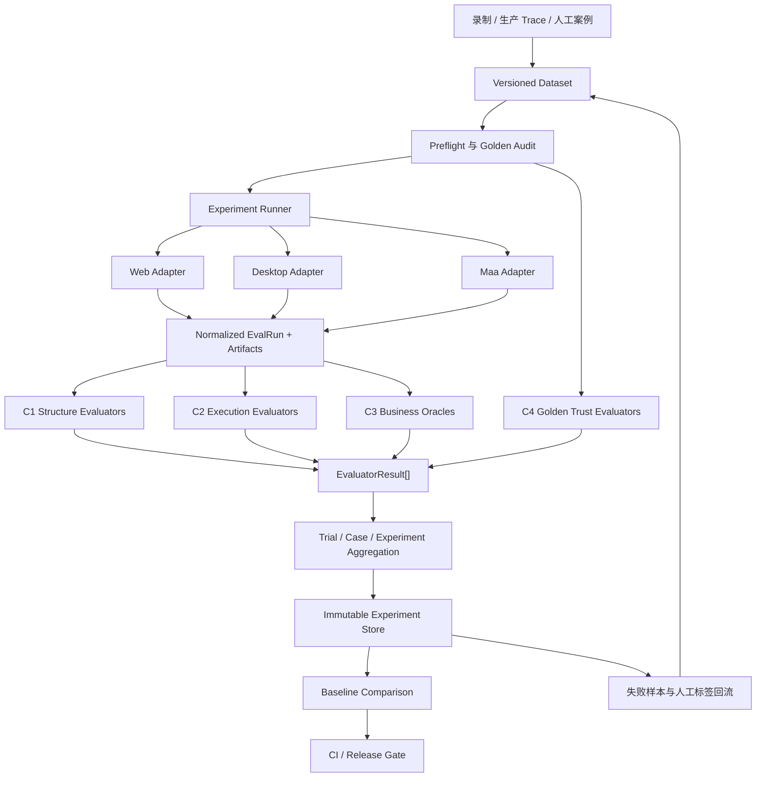

# Trace Evals 实验架构迁移设计

- 状态：待实施
- 目标版本：`trace-evals/v2`
- 文档日期：2026-10-09
- 预计投入：13–20 人日（1 名熟悉 Python 与现有回放链路的工程师）

## 1. 摘要与决策

本迁移不重写现有 evaluator，而是在它们外面增加一层成熟的
`Dataset → Task/Runner → Evaluators → Experiment → Gate` 架构。

现有代码继续承担两个不可互相替代的问题：

1. `trust/audit.py` 判断 Golden Trace 本身是否值得信；
2. `trust/maa_execution.py` 判断一次 Maa 执行是否遵循对应 Golden。

迁移后增加四项系统能力：

1. 统一调度 Web、Desktop、Maa 三类 Golden 回放；
2. 把“结构正确、执行一致、业务结果正确、Golden 可信”分层评估；
3. 用版本化 Dataset 和不可变 Experiment 管理多次运行与版本回归；
4. 用可解释、可配置的 Gate 阻止明确退化进入发布流程。

核心决策如下：

- 采用本地优先的实验架构，不要求 LangSmith、Braintrust 或其他云服务；
- 借鉴其 Data/Task/Evaluator/Experiment 抽象，但保留 EDR/Maa 领域数据结构；
- 通过 Adapter 包装现有模块，先稳定协议，再决定是否移动旧代码；
- 每个结果都携带证据和来源，不允许只返回一个无法解释的总分；
- 未经真实标签校准的数值只能用于排序，不得命名为概率；
- 回放成功不等于业务正确，业务正确必须由独立 Oracle 证明；
- 有副作用的回放默认串行，只有声明可隔离的 Case 才允许并发。

## 2. 背景与当前问题

当前仓库已经具备有价值的领域能力：

- `features.py` 从 Golden Trace 提取风险特征；
- `rules.py` 把特征转成带节点、证据和后果的发现项；
- `crosscheck.py` 对照 `recording.json` 与 Golden，发现编译时信息丢失；
- `mutate.py` 注入已知缺陷，验证 scorer 对退化是否敏感；
- `replay_lab.py` 重复回放并生成稳定性标签；
- `maa_execution.py` 校验摘要、节点顺序、动作、重试和视觉匹配；
- `validate.py` 检查变异单调性和失败节点命中能力。

但这些能力目前由不同脚本驱动，缺少统一的运行和数据边界：

- Case 主要表现为目录和若干 JSON 文件，没有稳定的 Case ID 与版本快照；
- 不同 evaluator 的输入、输出和错误语义不同，难以组合；
- 缺少统一 Run/Experiment 身份，无法稳定比较两个代码版本；
- 重复回放、环境准备、清理和无效运行由脚本各自处理；
- 结果聚合停留在少量固定统计，尚无切片、pairwise 和回归门禁；
- `taskSuccess` 只能证明执行路径，不能证明业务最终状态；
- 生产失败样本、人工标签和离线 Dataset 之间没有正式回流协议。

本设计解决的是“评估平台化”，不是增加更多拍脑袋权重。

## 3. 目标与非目标

### 3.1 目标

迁移完成后，系统必须支持：

1. 对一个版本化 Dataset 批量运行指定 Variant；
2. 为每个 Case 选择 `web`、`desktop` 或 `maa` Replay Adapter；
3. 每个 Case 运行一次或多次 Trial，并区分失败与环境无效；
4. 在回放前执行 Golden 静态审计；
5. 在回放后执行结构、轨迹、动作、视觉、网络和业务 Oracle 检查；
6. 生成逐 Case、逐 Trial 和整个 Experiment 的结果；
7. 比较 Candidate 与 Baseline，报告新增失败和已修复案例；
8. 在 CI 中根据明确阈值给出 `pass`、`fail` 或 `inconclusive`；
9. 所有结论可追溯到 Dataset、代码、Golden、环境与 evaluator 版本；
10. 保持当前 CLI 和核心函数在迁移期间可用。

### 3.2 非目标

首轮迁移明确不做：

- 不自动修复 Golden Trace；
- 不把 LLM Judge 作为发布阻断的唯一依据；
- 不建设在线多租户服务和权限系统；
- 不要求把敏感轨迹上传到外部 SaaS；
- 不在样本不足时输出“成功概率”；
- 不承诺将状态型回放安全地并行运行；
- 不用一个总分覆盖所有评估维度。

## 4. 正确性的分层定义

“Trace 正确”必须拆成四层，报告中不得混写：

| 层级 | 核心问题 | 主要证据 | 当前基础 |
|---|---|---|---|
| C1 结构正确性 | Trace 是否合法、完整且来源一致 | Schema、节点引用、摘要、状态、资产 | 已部分具备 |
| C2 执行一致性 | 实际执行是否遵循 Golden | 节点顺序、动作、重试、视觉/网络结果 | Maa 已具备 |
| C3 业务结果正确性 | 被测系统最终是否达到业务目标 | API、数据库、UI 状态、文件或配置 Oracle | 待新增 |
| C4 Golden 可信度 | Golden 是否适合作为“正确答案” | 稳定性、证据力、观测充分性、人工标签 | 已具备核心能力 |

建议使用以下总判定，不把加权平均当作真值：

```text
trace_correct =
    structure_valid
    AND execution_conformant
    AND business_oracles_passed
    AND golden_accepted
    AND stability_gate_passed
```

某一层缺少证据时返回 `inconclusive`，不得自动按通过处理。

## 5. 设计原则与不可破坏的约束

### 5.1 证据优先

每个失败结果至少包含：

- 稳定的 evaluator key；
- Case、Trial 和节点定位；
- 观察到的值与期望值；
- 可机器处理的 failure code；
- 人可读的 evidence 和 consequence；
- 产生结论的 evaluator 版本。

### 5.2 Reference 与 Execution 分离

Golden 审计结果和 Execution 评分必须分别存储。即使一次执行得到 100 分，
Golden 仍可能因为零断言、弱 Oracle 或易变选择器而被拒绝。

### 5.3 Artifact 不可变

进入 Experiment 的 Golden、Recording、Execution、截图和报告以摘要寻址。
同一个 `artifactDigest` 不得对应不同内容。

### 5.4 环境失败不污染质量标签

认证失效、目标系统不可达、测试数据缺失、执行器崩溃等标记为 `invalid` 或
`infra_error`，不计为业务失败，也不得悄悄排除。

### 5.5 有副作用回放默认串行

Case 必须声明副作用、初始状态策略和清理策略。没有隔离证明时，Runner 不允许
并发执行可能写同一目标的 Trial。

### 5.6 可复现优先于便利

Experiment 必须记录 Git SHA、Dataset digest、配置、环境标识、执行器版本、
evaluator 版本和 Trial 次序。缺少必要来源信息时结果为 `inconclusive`。

## 6. 目标架构



### 6.1 组件职责

| 组件 | 职责 | 禁止承担的职责 |
|---|---|---|
| Dataset | 固定输入、期望、标签和环境声明 | 不执行回放，不计算分数 |
| Replay Adapter | 准备、执行、收集、清理 | 不决定 Golden 是否可信 |
| Evaluator | 对一个明确维度给结论和证据 | 不修改被测系统或 Artifact |
| Oracle | 独立验证业务最终状态 | 不以“执行步骤成功”代替业务检查 |
| Aggregator | 汇总 Trial/Case/Experiment | 不掩盖逐 Case 失败 |
| Gate | 根据版本化策略决定发布 | 不动态修改阈值 |
| Store | 保存不可变结果和 Artifact 索引 | 不覆盖历史 Experiment |

## 7. 核心数据模型

所有公共 JSON 必须带 `schema` 字段。新增字段保持向后兼容；破坏性修改升级主版本。

### 7.1 EvalCase

```json
{
  "schema": "trace-evals.case/v1",
  "id": "maa-flow6",
  "input": {
    "recording": "artifacts/recording.json",
    "golden": "artifacts/trace.json"
  },
  "executor": "maa",
  "expected": {
    "goldenStatus": "accepted",
    "businessOutcome": "policy-enabled"
  },
  "oracles": [
    {
      "type": "api-json",
      "config": "oracles/policy-enabled.json"
    }
  ],
  "environment": {
    "profile": "edr-staging",
    "statePolicy": "reset-before-trial",
    "sideEffects": ["policy-write"]
  },
  "tags": ["maa", "policy", "write"],
  "metadata": {
    "owner": "edr",
    "risk": "high"
  }
}
```

约束：

- `id` 在 Dataset 版本内唯一；
- Artifact 路径相对 Dataset 根目录，禁止逃逸；
- 有写副作用的 Case 必须声明 `statePolicy`；
- 没有 Oracle 的写操作 Case 不能进入严格发布 Gate；
- Secret 只允许引用环境变量或 Secret ID，不得写入 Dataset。

### 7.2 VariantSpec

```json
{
  "schema": "trace-evals.variant/v1",
  "id": "candidate-c8e5ae6",
  "git": {"repository": "edr-cloud-recorder", "sha": "c8e5ae6"},
  "executor": {"name": "maa", "version": "git:016fa5a"},
  "config": {"targeting": "visual_only", "timeoutMs": 20000}
}
```

Variant 描述“被测实现”，不是 evaluator 配置。Evaluator 版本单独记录，以避免
把被测代码变化与评分器变化混在一起。

### 7.3 EvalRun

```json
{
  "schema": "trace-evals.run/v1",
  "runId": "exp-20261009-001/maa-flow6/candidate/02",
  "experimentId": "exp-20261009-001",
  "caseId": "maa-flow6",
  "variantId": "candidate-c8e5ae6",
  "trial": 2,
  "status": "completed",
  "startedAt": "2026-10-09T10:00:00+08:00",
  "finishedAt": "2026-10-09T10:00:12+08:00",
  "artifacts": {
    "golden": {"path": "...", "digest": "sha256:..."},
    "execution": {"path": "...", "digest": "sha256:..."}
  },
  "environment": {
    "profile": "edr-staging",
    "sessionId": "redacted",
    "initialStateDigest": "sha256:..."
  }
}
```

`status` 只能是：

- `completed`：执行结束，可以评分；
- `invalid`：认证、测试数据或前置状态使结果无效；
- `infra_error`：执行器、网络或基础设施失败；
- `cancelled`：人工或系统取消。

业务失败不使用 Run status 表达，而由 EvaluatorResult 表达。

### 7.4 EvaluatorResult

```json
{
  "schema": "trace-evals.result/v1",
  "key": "business.policy-enabled",
  "scope": "run",
  "verdict": "fail",
  "score": 0.0,
  "calibration": "deterministic",
  "failureCode": "EXPECTED_STATE_NOT_OBSERVED",
  "nodeId": "step_0009",
  "expected": {"enabled": true},
  "observed": {"enabled": false},
  "evidence": ["artifacts/oracle-response.json"],
  "comment": "写操作完成，但独立 API 查询仍返回 enabled=false",
  "evaluator": {"name": "api-json-oracle", "version": "1.0.0"}
}
```

约束：

- `verdict` 为 `pass`、`fail` 或 `inconclusive`；
- `score` 可选，不能替代 verdict；
- `calibration` 必须说明 `deterministic`、`ordering-only`、`calibrated` 或
  `judge-unvalidated`；
- LLM Judge 必须保存 rubric 版本、模型标识和理由；
- Gate 默认不允许 `inconclusive` 被当作 `pass`。

### 7.5 ExperimentManifest

ExperimentManifest 固定以下内容：

- Dataset 名称、版本和内容摘要；
- Baseline 与 Candidate Variant；
- Trial 数和执行次序；
- Case 过滤条件；
- evaluator bundle 及版本；
- Gate policy 版本；
- 创建时间、发起者和 Git SHA；
- 是否允许访问真实环境、是否允许写操作。

Manifest 创建后不可修改。重跑产生新的 Experiment ID。

## 8. 公共接口

### 8.1 ReplayAdapter

```python
class ReplayAdapter(Protocol):
    name: str

    def preflight(self, case: EvalCase, variant: VariantSpec) -> PreflightResult: ...
    def prepare(self, case: EvalCase, workspace: Path) -> PreparedRun: ...
    def run(self, prepared: PreparedRun) -> ExecutionArtifact: ...
    def collect(self, prepared: PreparedRun) -> list[ArtifactRef]: ...
    def cleanup(self, prepared: PreparedRun, outcome: RunOutcome) -> CleanupResult: ...
```

Adapter 必须满足：

- `preflight` 和 `prepare` 不产生未声明的业务写操作；
- `run` 总是生成或明确说明为什么无法生成 Execution Artifact；
- `cleanup` 在成功、业务失败、异常和取消后都执行；
- 清理失败单独记录，不能覆盖主要失败原因；
- Adapter 不直接计算质量分数。

### 8.2 Evaluator

```python
class Evaluator(Protocol):
    key: str
    version: str
    scope: Literal["case", "run", "experiment"]

    def evaluate(self, context: EvalContext) -> EvaluatorResult: ...
```

Evaluator 必须是只读的。相同输入 Artifact 和版本必须产生相同确定性结果；
非确定性 evaluator 必须记录模型、采样参数、重试和原始响应摘要。

### 8.3 Oracle

首批支持四类 Oracle：

| Oracle | 用途 | 典型证据 |
|---|---|---|
| `api-json` | 验证后端资源最终状态 | 请求摘要、响应 JSON、JSONPath |
| `ui-state` | 验证 UI 文本、属性或控件状态 | 截图、定位结果、控件属性 |
| `file-content` | 验证文件或配置落盘 | 文件摘要、受控字段 |
| `command-json` | 调用受控只读命令验证 | 命令标识、退出码、JSON 输出 |

Oracle 不允许包含任意内联 shell。`command-json` 只能引用仓库中登记的命令 ID。

### 8.4 Aggregator 与 Gate

Aggregator 分三层：

1. Trial：保留单次证据，不做多数投票掩盖失败；
2. Case：计算 `stable-green`、`stable-red`、`flip`、`drifting` 或 `invalid`；
3. Experiment：计算通过率、分层指标、切片和 Baseline 差异。

Gate policy 示例：

```yaml
schema: trace-evals.gate/v1
rules:
  - metric: new_case_failures
    op: eq
    value: 0
  - metric: trace_integrity_rate
    op: eq
    value: 1.0
  - metric: stable_green_rate
    op: gte-baseline
    tolerance: 0.0
  - metric: silent_pass_count
    op: eq
    value: 0
inconclusive: fail
```

Gate 只读取已经落盘的 Experiment，不重新运行 evaluator。

## 9. 端到端执行流程

### 9.1 创建 Experiment

1. 解析 Dataset，并验证所有 Case；
2. 解析 Variant、evaluator bundle 和 Gate policy；
3. 计算输入摘要并写入不可变 Manifest；
4. 根据 side effect 和环境资源生成执行计划；
5. `--dry-run` 输出计划但不执行回放。

### 9.2 Case 预检

1. 校验 Artifact 存在且摘要一致；
2. 执行 Golden 结构检查；
3. 执行 Golden trust audit；
4. 检查环境、认证和测试数据；
5. 确认 state policy 与 cleanup policy；
6. 严重 Golden 问题根据策略阻止回放或标记为观察性运行。

### 9.3 Trial 执行

1. 建立独立工作目录；
2. 记录初始状态和环境元数据；
3. Adapter prepare；
4. Adapter run；
5. 收集 Execution、截图、网络证据和日志；
6. 运行 C1/C2 evaluator；
7. 运行独立业务 Oracle；
8. 执行 cleanup 并验证清理结果；
9. 原子写入 Run 与 Result；
10. 下一 Trial 根据 state policy 重新初始化或保留状态。

### 9.4 汇总与比较

1. 按 Case 聚合 Trial，分类稳定性；
2. 按 tag、executor、risk、failure code 做切片；
3. 与 Baseline 做逐 Case pairwise 比较；
4. 列出新增失败、已修复、漂移和无效案例；
5. 执行 Gate；
6. 生成 JSON 和 Markdown 报告。

## 10. Golden 回放设计

### 10.1 Web Adapter

包装 `edr-cloud-recorder/scripts/replay_trace.py`：

- 输入 `trace.json` 与模板目录；
- 输出 Web Execution Trace；
- 保存网络响应、目标定位方式和最终截图；
- 将认证失效识别为 `invalid`；
- 支持 `dom_first` 和 `visual_only` Variant；
- 不在 Adapter 内使用 trust score。

### 10.2 Maa Adapter

包装 `edr-cloud-recorder/scripts/replay_maa.py`：

- 支持 Web Golden 和 Desktop Golden 转 Maa 节点表；
- 导出 portable Maa Golden，并以摘要绑定 Execution；
- 输出 `edr.maa-execution-trace/v1`；
- 使用现有 `trust.maa_execution.evaluate` 评分；
- `incomplete` 转换必须在运行前失败。

### 10.3 Desktop Adapter

通过 `edr-wd` 的执行接口运行 Desktop Golden：

- 保存窗口、进程和控件树证据；
- 区分控件定位失败、动作失败和 verifier 失败；
- 显式记录仅 desktop runtime 支持的 verifier；
- 禁止依靠当前活动窗口猜测目标，除非 Case 明确允许。

### 10.4 状态策略

支持三种状态策略：

- `reset-before-trial`：每轮恢复到已知状态，适合独立重复性测试；
- `carry-forward`：保留上轮副作用，专门发现状态依赖和盲切换；
- `snapshot-restore`：每轮从同一快照开始，适合可快照环境。

Dataset 应同时包含 reset 与 carry-forward Case，避免只在理想初始状态下测试。

## 11. Trace 正确性 Evaluator Bundle

默认 Bundle 顺序如下：

1. `artifact.integrity`：摘要、Schema、来源和版本；
2. `golden.structure`：节点、入口、可达性、重复和状态；
3. `golden.trust`：现有 replay/evidence/observe 三轴发现；
4. `execution.completion`：必要节点是否完成；
5. `execution.action`：动作类型和关键参数是否匹配；
6. `execution.trajectory`：strict/subset/unordered 等轨迹比较；
7. `execution.visual`：模板匹配和视觉置信度；
8. `execution.network`：必需网络响应及内容；
9. `business.*`：独立 Oracle；
10. `stability.classification`：跨 Trial 稳定性；
11. `meta.scorer_health`：变异单调性、标签一致性和 scorer 漂移。

其中 1–9 是逐 Case/Run evaluator，10–11 是 Case 或 Experiment evaluator。

## 12. 存储布局

建议新增包与数据布局：

```text
trace-evals/
├── trace_eval/
│   ├── contracts.py
│   ├── artifacts.py
│   ├── datasets.py
│   ├── runner.py
│   ├── storage.py
│   ├── aggregate.py
│   ├── gates.py
│   ├── cli.py
│   ├── adapters/
│   │   ├── web.py
│   │   ├── desktop.py
│   │   └── maa.py
│   └── evaluators/
│       ├── golden_trust.py
│       ├── execution.py
│       ├── trajectory.py
│       ├── oracles.py
│       └── stability.py
├── trust/                       # 迁移期保留，作为已有实现
├── datasets/
│   └── smoke/
│       ├── manifest.jsonl
│       └── artifacts/
├── gate-policies/
│   └── default.yaml
├── test/
└── docs/
```

实验输出默认写到 Git 忽略的 `.evals/`：

```text
.evals/experiments/<experiment-id>/
├── manifest.json
├── plan.json
├── runs/<case-id>/<variant-id>/<trial>/
│   ├── run.json
│   ├── results.jsonl
│   └── artifacts/
├── summary.json
├── comparison.json
├── gate.json
└── report.md
```

所有文件先写临时文件，再通过原子替换落盘，避免中断产生半份合法 JSON。

## 13. CLI 设计

```bash
# 验证 Dataset 和引用的 Artifact
python -m trace_eval dataset validate datasets/smoke

# 只查看执行计划，不触发真实回放
python -m trace_eval run datasets/smoke \
  --variant variants/candidate.json --trials 2 --dry-run

# 执行 Experiment
python -m trace_eval run datasets/smoke \
  --variant variants/candidate.json --trials 2

# 比较两个不可变 Experiment
python -m trace_eval compare <baseline-id> <candidate-id>

# 应用发布门禁
python -m trace_eval gate <candidate-id> \
  --baseline <baseline-id> --policy gate-policies/default.yaml
```

CLI 退出码：

- `0`：命令成功且 Gate 通过；
- `1`：命令成功但评估或 Gate 不通过；
- `2`：输入、配置或基础设施错误；
- `130`：被中断，已尝试清理并保存取消状态。

## 14. 安全、隐私与运行约束

1. Dataset 和报告不得保存密码、Token、Cookie 或完整认证状态；
2. 敏感字段在写 Artifact 前按字段路径脱敏；
3. 有写副作用的 Case 需要显式 `--allow-write`；
4. `--dry-run` 保证不调用 Adapter `run`；
5. 清理动作不得扩大到 Case 声明之外的资源；
6. 每个写 Case 必须定义最大 Trial 数和停止条件；
7. 连续出现认证失效时停止剩余 Case，避免制造整批假红；
8. LLM Judge 默认只读取脱敏摘要，不直接读取原始敏感 Artifact；
9. 外部 SaaS 上传必须由单独配置显式开启；
10. 日志保留期和 Artifact 保留期分别配置。

## 15. 兼容与迁移策略

采用 Strangler 模式，不进行一次性重写：

1. `trust/` 继续作为现有实现；
2. 新 `trace_eval/evaluators/golden_trust.py` 只做协议适配；
3. 新 `trace_eval/evaluators/execution.py` 调用 `trust.maa_execution.evaluate`；
4. 旧 CLI 在至少两个发布周期内保留；
5. 新旧 CLI 对同一输入必须生成语义等价的核心结果；
6. 公共 JSON Schema 稳定后，才允许把实现从 `trust/` 移入新包；
7. 每次迁移一个边界，禁止同时重构 scorer 逻辑和实验协议。

## 16. 分轮实施计划与验收标准

总原则：每轮只闭环一个能力；新增能力必须有一个在缺少该能力时会失败的测试。
每轮结束都要更新 `trust/STATUS.md` 或新的迁移状态文档，并保存实际数字。

### Round 0：冻结基线与契约样本

预计：0.5–1 人日。

目标：在修改架构前固定当前可观察行为，避免迁移过程中无意改变评分语义。

代码修改：

- 增加 `test/fixtures/contracts/`，保存最小 Golden、Recording、Maa Execution；
- 保存现有 `audit()` 和 `maa_execution.evaluate()` 的 Golden Result；
- 增加字符级稳定的 JSON 序列化辅助；
- 记录当前测试基线和依赖的 recorder Git SHA。

验收标准：

- 现有测试全部通过；
- 至少覆盖成功、失败、optional skip、digest mismatch 和 incomplete Golden；
- 固定输入连续运行两次得到完全相同的确定性结果；
- Fixture 不含 Secret、真实 IP、账号或 Cookie；
- 未修改现有评分公式和规则权重。

退出条件：基线 Fixture 和预期结果进入 Git，后续 Round 可以检测兼容性退化。

### Round 1：统一 Contract 与 Result 协议

预计：1–1.5 人日。

目标：让所有 evaluator 通过同一个接口返回结构化结果。

代码修改：

- 新增 `trace_eval/contracts.py`；
- 定义 `EvalCase`、`ArtifactRef`、`EvalRun`、`EvaluatorResult`；
- 新增 Golden Trust 与 Maa Execution adapter evaluator；
- 为公共结构增加严格解析、版本检查和 JSON round-trip。

验收标准：

- 现有 audit 和 Maa evaluator 都能转换为 `EvaluatorResult[]`；
- 每个 fail 结果具有 `key`、`failureCode`、`evidence` 和 evaluator version；
- 未知主版本被拒绝，未知附加字段可保留或忽略；
- JSON round-trip 不丢字段；
- 新协议结果与 Round 0 核心结论完全一致。

退出条件：后续 Runner 不再直接解析各 evaluator 的私有返回结构。

### Round 2：版本化 Dataset 与 Artifact 完整性

预计：1–2 人日。

目标：把零散目录变成可复现、可寻址的数据集。

代码修改：

- 新增 `trace_eval/datasets.py` 和 `artifacts.py`；
- 定义 `manifest.jsonl` 与 Dataset digest；
- 将现有真实语料登记为 Dataset，但不复制敏感 Artifact；
- 新增 `dataset validate` 和 `dataset snapshot`；
- 校验相对路径、摘要、Case ID、Secret 与副作用声明。

验收标准：

- Dataset 同内容得到相同 digest，任一 Artifact 修改都会改变 digest；
- 重复 Case ID、路径逃逸、摘要不符和缺失 Artifact 必须失败；
- 写操作 Case 缺少 state policy 时必须失败；
- Snapshot 后修改源目录不影响已创建的 Experiment 输入；
- 至少有一个可公开提交的 smoke Dataset。

退出条件：Experiment 只接受通过验证的 Dataset snapshot。

### Round 3：Experiment Runner 与 Replay Adapter

预计：2–3 人日。

目标：统一执行 Web、Maa，预留 Desktop，并可靠保存 Run Artifact。

代码修改：

- 新增 `runner.py`、`storage.py` 和 Adapter Protocol；
- 实现 Web、Maa Adapter；
- Desktop 先实现 preflight 和接口桩，真实执行在环境可用时接入；
- 增加 dry-run、超时、取消、原子落盘和 cleanup 生命周期；
- 记录 Git、环境、Variant、Trial 和 Artifact 摘要。

验收标准：

- dry-run 不产生目标系统写操作；
- Web 与 Maa smoke Case 各完成一次端到端 Run；
- 执行异常、Ctrl-C 和业务失败后 cleanup 都被调用；
- 进程在落盘中途终止不会产生被解析为 completed 的半份 Run；
- 相同 Experiment 中 Run ID 唯一且可从 ID 定位全部 Artifact；
- 认证失效被标记为 `invalid`，不计业务失败。

退出条件：可以通过一个命令产生可复查的单 Variant Experiment。

### Round 4：业务 Oracle 与完整正确性判定

预计：2–3 人日。

目标：从“步骤跑完”升级到“业务结果被独立证明”。

代码修改：

- 新增 `evaluators/oracles.py`；
- 实现 `api-json`、`ui-state` 和 `file-content` Oracle；
- 定义 Oracle 配置 Schema 和 evidence Artifact；
- 实现 C1–C4 分层报告与 `trace_correct` 合取判定；
- 对无 Oracle 的写 Case 输出 `inconclusive`。

验收标准：

- 构造“执行全成功但后端状态错误”的 Case，最终必须 fail；
- 构造“业务正确但 Execution digest 不匹配”的 Case，最终必须 fail；
- 构造“执行与业务均通过但 Golden 不可信”的 Case，结果必须分层展示，不能
  折叠成一个绿色总分；
- Oracle 失败保留 observed、expected 和可复查证据；
- Oracle 不允许任意 shell 或未登记的网络目标。

退出条件：报告能明确回答结构、执行、业务和 Golden 四层结论。

### Round 5：重复 Trial、状态策略与稳定性

预计：1.5–2 人日。

目标：系统化检测抖动、状态污染和环境无效。

代码修改：

- Runner 支持 `trialCount` 和确定性执行顺序；
- 实现 reset、carry-forward、snapshot-restore 三种状态策略接口；
- 将现有 `replay_lab.label_of` 接入统一 Aggregator；
- 保存每轮初始状态摘要和 cleanup 结果；
- 对写同一目标的 Case 加资源锁。

验收标准：

- `{pass, pass}` → `stable-green`；
- `{fail, fail}` → `stable-red`；
- `{pass, fail}` → `flip`；
- 全 pass 但关键轨迹指标不同 → `drifting`；
- 任一 Trial 为认证失效时按策略标记 `invalid`，不能错误产生 stable-red；
- 未声明隔离的写 Case 不并发；
- carry-forward 测试能暴露一个人工构造的状态依赖缺陷。

退出条件：Case 稳定性来自统一 Experiment，而不是独立 JSONL 脚本。

### Round 6：聚合、Baseline 比较与回归分析

预计：2 人日。

目标：把逐 Run 结果变成可用于工程决策的 Experiment 对比。

代码修改：

- 新增 `aggregate.py` 和 `compare` CLI；
- 实现 Case、tag、executor、risk、failure code 切片；
- 实现 Baseline/Candidate 逐 Case pairwise；
- 生成 `summary.json`、`comparison.json` 和 `report.md`；
- 新增失败、修复、漂移、无效分别列出。

验收标准：

- 同一 Dataset 版本才能直接做严格 pairwise；
- Dataset 不同时必须报告 Case 增删，不能静默比较均值；
- 聚合结果可由逐 Run 结果重新计算；
- 任一总指标都能下钻到贡献 Case；
- 报告优先列出新增失败，不用平均分掩盖少数严重退化；
- Snapshot 测试保证历史 Experiment 不随当前代码重新解释。

退出条件：可以回答“Candidate 相对 Baseline 新坏了什么、修好了什么”。

### Round 7：CI Gate 与迁移收口

预计：1–2 人日。

目标：将 Experiment 结果转成可审计的发布决策，同时保持旧接口兼容。

代码修改：

- 新增 `gates.py`、Gate Schema 和默认 policy；
- 增加 `gate` CLI 与稳定退出码；
- 在 CI 中执行 smoke Dataset；
- 更新 `SKILL.md`、README 和运维说明；
- 标记旧 CLI 的兼容期和弃用条件。

验收标准：

- 新增 Case 失败时 CI 返回 1；
- 配置错误、Artifact 缺失或基础设施错误返回 2；
- `inconclusive` 默认阻断，除非 policy 明确放行；
- Gate 报告包含命中的规则与证据，不只显示“未通过”；
- 现有 97 项测试保持通过，并新增端到端 smoke 测试；
- 旧 CLI 在兼容期内仍产生与 Round 0 一致的核心结果。

退出条件：团队可以用固定 Dataset 和 Gate 做重复、可解释的发布判断。

### Round 8：可选增强——平台集成、人工评审与 LLM Judge

预计：3–5 人日，不计入首个可用版本的硬性范围。

目标：在已有本地协议稳定后增加外部平台或主观评估能力。

可选修改：

- 导出 Braintrust/LangSmith 兼容的 Dataset 与 Experiment；
- 引入 AgentEvals trajectory match 作为可插拔 evaluator；
- 增加人工 review queue；
- 增加 LLM Judge，但只处理规则不可见的业务语义；
- 用人工标签评估 Judge 的一致性、假通过和提示注入敏感性。

验收标准：

- 外部集成关闭时本地全功能可用；
- 未脱敏 Artifact 不上传；
- Judge 结果标记 `judge-unvalidated`，直到达到预先定义的人类一致性标准；
- Judge 失败或不可用不影响确定性 evaluator 运行；
- Judge 不拥有覆盖 C1/C2 确定性失败的权限。

退出条件：外部平台和 LLM 是插件，不成为本地评估的单点依赖。

## 17. 总体验收标准

迁移完成必须同时满足：

1. 一个命令能对版本化 Dataset 执行 Golden audit、Replay、Oracle 和聚合；
2. Web 与 Maa 至少各有一个端到端 Case，Desktop 有可验证 Adapter；
3. “回放成功但业务错误”不会被判为正确；
4. “Execution 正确但 Golden 不可信”会被分层报告；
5. 重复 Trial 能区分 stable-green、stable-red、flip、drifting 和 invalid；
6. Baseline/Candidate 对比能列出逐 Case 回归；
7. CI Gate 能阻断新增确定性失败；
8. 所有结果可追溯到 Dataset、代码、环境、Artifact 和 evaluator 版本；
9. 敏感信息不会进入 Git 或外部服务；
10. 当前确定性规则、变异 meta-eval 和旧 CLI 行为没有无依据退化。

## 18. 风险与缓解

| 风险 | 影响 | 缓解措施 |
|---|---|---|
| 真实环境有状态 | Trial 相互污染 | 状态策略、资源锁、初始状态摘要、cleanup 验证 |
| 认证中途失效 | 整批假红 | invalid 分类、熔断后续 Case、认证健康检查 |
| Schema 同步漂移 | evaluator 误读产物 | Artifact schema/version、契约 Fixture、依赖 SHA |
| Golden 本身错误 | 成功执行仍是假绿 | Golden audit 与业务 Oracle 独立 Gate |
| 标签过少 | 无法校准概率 | 保留 ordering-only，收集人工/重复回放标签 |
| 总分掩盖严重失败 | 错误发布 | 分层 verdict、新增失败优先、关键指标硬 Gate |
| 外部平台泄露数据 | 安全事件 | 本地优先、显式启用、脱敏和上传白名单 |
| 一次性重构过大 | 难以定位回归 | Adapter 迁移、Round 0 基线、每轮单一边界 |

## 19. 回滚策略

每轮保持可独立回滚：

- 新代码通过新包和 Adapter 接入，不直接删除 `trust/`；
- 新 CLI 与旧 CLI 并存；
- Dataset 和 Experiment Schema 使用独立版本；
- Gate 未达到稳定标准前只报告、不阻断；
- 外部平台集成只做导出，不成为唯一存储；
- 发现评分语义变化时回退 Adapter，不回写历史 Experiment。

回滚后历史 Artifact 与结果仍可读取；如果读取器无法支持某版本，必须明确报错，
禁止使用当前规则静默重新解释旧结果。

## 20. 工作量与里程碑

| 里程碑 | Round | 预计人日 | 可交付能力 |
|---|---:|---:|---|
| M1 协议稳定 | 0–2 | 3–4.5 | Contract、Dataset、Artifact 完整性 |
| M2 可回放与正确性 | 3–5 | 5.5–8 | Web/Maa 回放、Oracle、重复 Trial |
| M3 工程化发布 | 6–7 | 3–4 | 对比、报告、CI Gate |
| M4 可选生态集成 | 8 | 3–5 | SaaS 导出、人工评审、LLM Judge |

首个团队可用版本为 M1–M3，总计约 11.5–16.5 人日；考虑真实环境调试与
Desktop Adapter，不确定性缓冲后按 13–20 人日排期。

## 21. 参考架构

- Braintrust：Data、Task、Evaluator、Experiment 与反馈闭环
  <https://www.braintrust.dev/docs/evaluate>
- Braintrust Datasets：版本化测试案例与 Experiment 绑定
  <https://www.braintrust.dev/docs/annotate/datasets>
- LangSmith：离线/在线评估与 code、LLM、summary、pairwise evaluator
  <https://docs.langchain.com/langsmith/evaluation-types>
- LangChain AgentEvals：strict、unordered、subset、superset 轨迹比较
  <https://github.com/langchain-ai/agentevals>
- DeepEval：Trace、Span 与 component/trajectory/end-to-end 分层评估
  <https://deepeval.com/docs/evaluation-llm-tracing>

这些框架提供成熟的实验管理方法，但通常默认 reference/golden 可信。本项目保留
Golden trust audit，作为成熟 Experiment 架构之前的参考质量门。
